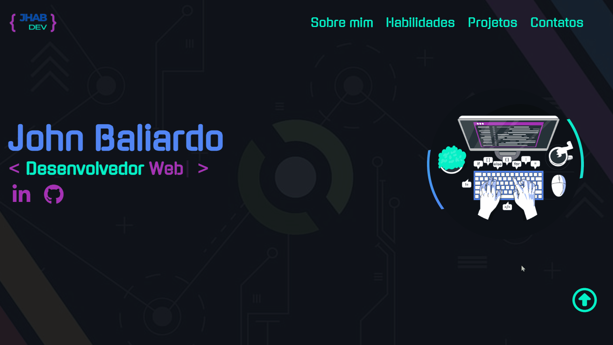

# "Como está meu desenvolvimento?"

Essa página foi desenvolvida especialmente para essa análise.

Propositalmente estruturada com a trindade (HTML-CSS-JavaScript) para aprendizado e aprimoramento dessa base.

Mais tarde me aprimorei no Front end e hoje desenvolvo utilizando React, mas o aprendizado é contínuo e constante.

Essa página ficará para sempre com essa estrutura para que me lembre sempre de como foi.

 

# "How is my development?"

This page was developed especially for this analysis.

It was purposely structured with the trinity (HTML-CSS-JavaScript) to learn and improve this foundation.

I later improved my front-end skills and today I develop using React, but learning is continuous and constant.

This page will always have this structure so that I can always remember what it was like.

You can view the project via the link:  
https://srbaliardo.github.io/sitePortfolio

 

 

"  |
 |
 "
